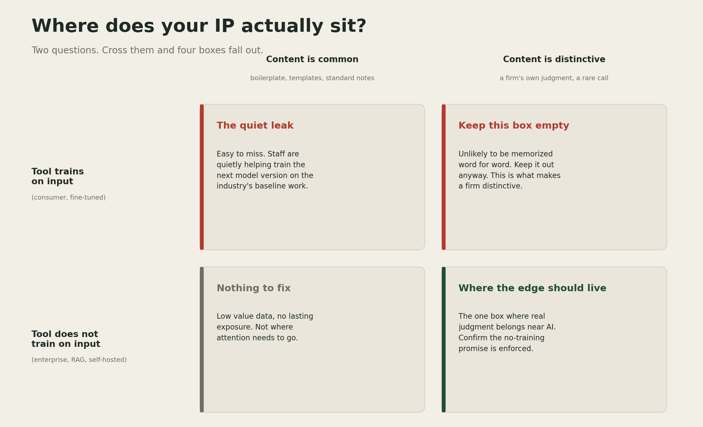

# The Quiet Leak

AI tools do two very different things with a file. Some just read it and answer your question. Others learn from it, and can repeat parts of it later, to someone else. The interface looks the same either way, so it is not always obvious which one you are using.

Here is a simple way to check.

## Question 1: does the tool learn from what you give it?

Paid business accounts, the Enterprise or API versions of ChatGPT and Claude, do not train on your data by default. That is written into the contract, not just a promise on a marketing page ([OpenAI](https://openai.com/enterprise-privacy/); [Anthropic](https://www.anthropic.com/news/updates-to-our-consumer-terms)). Free consumer accounts often work the other way: they can train on what you type, unless you find the setting and turn it off yourself.

There is a second layer underneath that. Some AI setups look your document up each time you ask a question, use it once, and never store it. This is called RAG. Others, called fine-tuning, bake your document into the model itself, permanently. Most companies now lean on the first method ([IBM](https://www.ibm.com/think/topics/rag-vs-fine-tuning); [Databricks](https://www.databricks.com/blog/rag-vs-fine-tuning)). A firm that wants full control can go one step further and run its own AI on its own servers, so nothing leaves the building at all ([deployment guide](https://www.digitalapplied.com/blog/self-hosting-open-weight-llms-2026-deployment-decision-guide)).

## Question 2: is what you're sharing common, or is it yours?

This is the part that surprised me. Researchers who study how AI models memorize things found that models do not memorize the most sensitive material first. They memorize whatever they have seen the most times ([Carlini et al., ICLR 2023](https://arxiv.org/abs/2202.07646)).

A standard calculation note, the kind every firm uses in some form, gets typed into the same AI tools thousands of times a week across the whole industry. That repetition is exactly what makes something easy for a model to remember.

A senior engineer's unusual, one of a kind call on a hard project shows up once, maybe never again anywhere else. Models are bad at remembering things they only saw once.

In plain terms: the more a piece of text repeats, across the whole industry using the same tools, the more likely AI remembers it.

## The four boxes

Put the two questions together and four situations fall out.

The surprising box is the top left. That is probably where most everyday AI use already sits, and nobody worries about it, because nothing in it looks sensitive.

The one to protect hardest is the top right: work that is genuinely a firm's own, going into a tool that trains on it. Keep that combination from ever happening. The odds of any single leak are small. The cost of the one time it happens is not.

## A simple example

A standard load calculation note: common, low stakes either way. Moving it to a company account instead of a personal one costs nothing and closes the risk regardless.

An unusual foundation fix a senior engineer worked out on site: rare, high stakes. This one should never go into a tool that trains on it, no matter how convenient the shortcut feels in the moment.

## What I'm not sure about

I cannot verify that any AI company actually keeps its "we do not train on your data" promise. Nobody outside those companies can check. The memorization research above was done on smaller, open models, not the newest ones most firms use today. The pattern itself is well tested. The exact risk on any specific tool right now is not something I, or anyone outside the labs, can prove.

[YOUR DETAIL HERE]

## The takeaway

> The file you worry about least is often the one AI remembers best. The file you would fight hardest to protect is the one that should never go near a tool that remembers anything at all.

## A prediction

> Prediction (2026-07-10): It would not surprise me if, sometime next year, a major insurer covering engineering or consulting firms started asking which tier of AI tool handled which kind of project data, rather than only whether the firm uses AI. Confidence: low.

I could be far off on this one. It may simply be too early for insurers to draw a line this precise.

## What I'm watching

Whether any AI company lets a firm actually verify its no-training promise, instead of asking the firm to trust it. And whether firms' own private AI setups get good enough that this whole trade-off quietly disappears.

---

<!--
Author note, delete before publishing:
- Replace [YOUR DETAIL HERE] with one specific thing only you know.
- Run the pre-publish checklist in docs/style-guide.md.
- Does not name AECOM or any specific AEC competitor, per your note that AECOM is a direct
  competitor.
- Matrix image generated at assets/ip-exposure-matrix.png via scripts/make_ip_matrix.py,
  matching the palette used in assets/tokenomics-framework.png.
- Copy the prediction into templates/predictions-ledger.md the day this publishes.
-->
