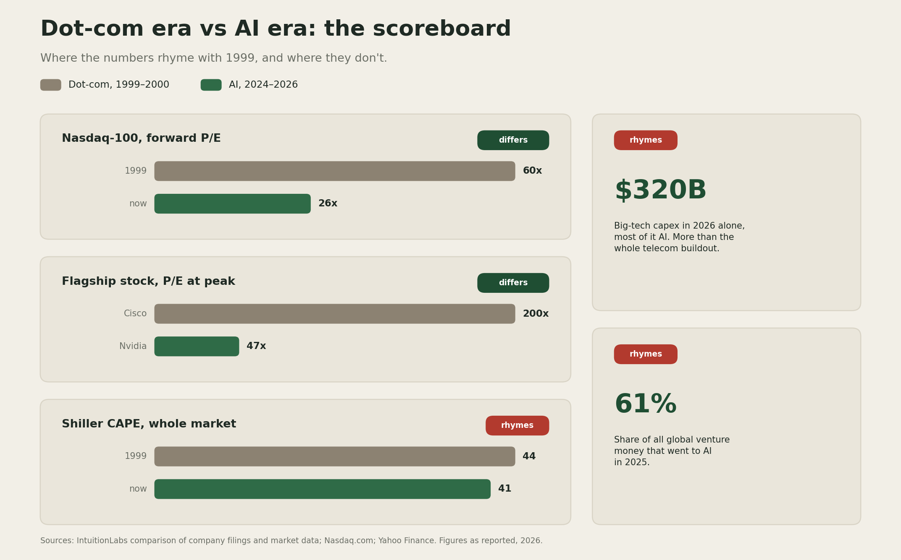
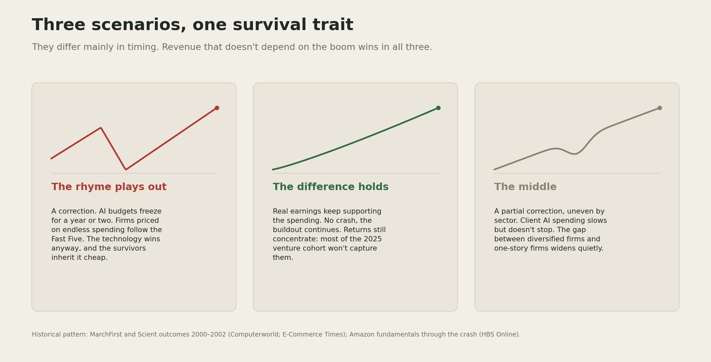

# What Survived 2000

Everyone asks whether AI is the next dot-com bubble. I think a more useful question is what decided who survived last time. The internet was real, it did change everything, and the firms built purely on that correct belief still died. That's the part of the 2000 story worth studying.

## The scoreboard

I put the two eras side by side, using the numbers rather than the mood.

The similarities sit on the money side. Big tech is expected to spend about $320 billion on capex in 2026, most of it AI, more in one year than the entire dot-com telecom buildout ([IntuitionLabs](https://intuitionlabs.ai/articles/ai-bubble-vs-dot-com-comparison)). AI took 61% of all global venture money in 2025. And while today's market multiple looks tame next to 2000, the Shiller CAPE sits near 41, the second-highest in 125 years of data.

The differences sit on the earnings side. Cisco peaked near 200 times earnings while its margins were shrinking, and it took roughly 25 years for peak buyers to get their money back ([Yahoo Finance](https://finance.yahoo.com/markets/stocks/articles/cisco-took-25-years-investors-203636211.html)). Nvidia trades near 47 times, on $215.9 billion of real revenue ([Nasdaq](https://www.nasdaq.com/articles/why-nvidia-stock-not-cisco-dot-com-bubble-burst)). In 2000 the rally was led by companies promising profits. This one is led by companies booking the largest profits in corporate history.

## The part that matters for consulting

In the late 1990s, a group of pure-play internet consultancies, the "Fast Five" (Scient, Viant, Razorfish, iXL, MarchFirst), sold digital transformation at boom rates and reached multibillion-dollar valuations. They were the fast, exciting alternative to the big incumbent firms.

MarchFirst, the largest, was formed in March 2000, peaked at $52 a share, and filed for bankruptcy on April 12, 2001, a week after laying off 1,700 people, with its stock halted at 31 cents ([Computerworld](https://www.computerworld.com/article/1440021/marchfirst-files-for-bankruptcy-protection.html); [E-Commerce Times](https://www.ecommercetimes.com/story/marchfirst-files-for-bankruptcy-8940.html)). Scient cut more than half its staff in 2001 and was bankrupt by mid-2002 ([Encyclopedia.com](https://www.encyclopedia.com/economics/encyclopedias-almanacs-transcripts-and-maps/scient-corp)). Within three years, all five were gone or absorbed.

The internet thesis was correct and the technology won completely. What killed them was that their revenue depended on clients spending like the boom would never pause, and it paused. The diversified incumbents, with boring clients and steady work, walked through it. And the companies that owned the next twenty years, like Amazon, were the ones with working fundamentals when the money stopped ([HBS](https://online.hbs.edu/blog/post/how-amazon-survived-the-dot-com-bubble)).

## Three scenarios

**The rhyme plays out.** A correction comes, AI budgets freeze for a year or two, and the firms priced on uninterrupted AI spending, including AI-pure-play consultancies, follow the Fast Five. The technology keeps winning anyway, and the survivors inherit it cheap.

**The difference holds.** Real earnings keep supporting the spending, there is no crash, and the buildout continues. Even then, returns concentrate: most of the 2025 venture cohort will not be the ones who capture them.

**The middle.** A partial correction, uneven by sector. Client AI spending slows but does not stop, and the gap between firms with diversified revenue and firms with one story widens quietly rather than dramatically.

I don't know which one we get. Nobody does; the 2000 crash surprised the people closest to it. What I take from the history is that the scenarios differ mainly in timing, and the survival trait is the same in all three: revenue that doesn't depend on the boom continuing.

[YOUR DETAIL HERE]

## The takeaway

> Being right about the technology protected no one in 2000. The internet won and its purest believers went bankrupt anyway. What survived was boring revenue and real fundamentals, and I see no reason the AI era would grade differently.

## A prediction

> Prediction (2026-07-18): It would not surprise me if, within two years, at least one well-funded AI-pure-play consultancy or services firm fails or is absorbed at a fraction of its peak valuation, in the pattern of the Fast Five, even while overall AI adoption keeps growing. Confidence: medium.

I may be early on this. The earnings underneath this boom are real in a way 1999's were not, and that could stretch the timeline well past anything the dot-com comparison suggests.

## What I'm watching

Whether big-tech capex guidance for 2027 holds or gets trimmed, since that is the single number the whole buildout rests on. And how the AI-pure-play consultancies price their work: the ones locking in multi-year, outcome-tied contracts are building the boring revenue that survives; the ones selling boom-rate day rates are repeating the part of 1999 that did not.

---

<!--
Author note, delete before publishing:
- Replace [YOUR DETAIL HERE] with one specific thing only you know: something you remember or
  heard from the dot-com years, a client conversation about AI budgets, a pitch from an
  AI-pure-play firm you have seen recently.
- Run the pre-publish checklist in docs/style-guide.md.
- The "$320B exceeds the cumulative telecom buildout" claim is attributed to IntuitionLabs and
  not independently inflation-adjusted; it is phrased as their comparison, not a flat fact.
- Scoreboard image generated at assets/dotcom-ai-scoreboard.png via
  scripts/make_dotcom_scoreboard.py, same palette as the previous two assets.
- Copy the prediction into templates/predictions-ledger.md the day this publishes.
-->
