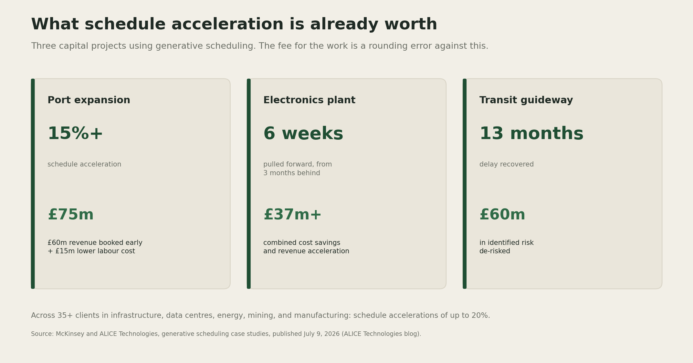
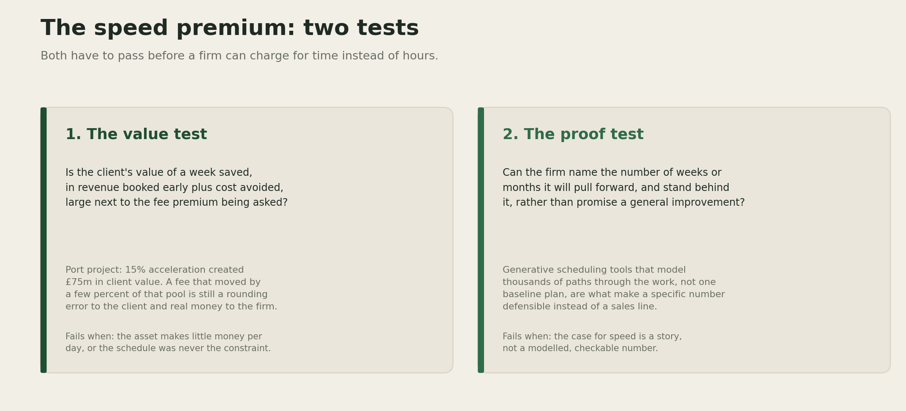

# The Speed Premium

A real price is starting to show up for how much a shorter schedule is worth, and right now the client keeps nearly all of it.

AI is compressing how long engineering delivery takes. Right now the client keeps almost all of the value created when that happens. The firms that reprice around the days they pull forward, instead of the hours it took to pull them forward, get to keep a share of a pool of value that recent case studies put in the tens of millions of pounds per project.

## The problem, before any vendor's pitch

Bent Flyvbjerg, an Oxford professor who has spent three decades studying large projects, put the baseline plainly: nine out of ten megaprojects run over budget, and by his own arithmetic, roughly one project in a thousand hits its cost, schedule, and benefit targets all three at once ([Flyvbjerg, "The Iron Law of Megaproject Management," Oxford Handbook of Megaproject Management, 2017](https://ti.org/pdfs/IronLawofMegaprojects.pdf)). London's Jubilee Line extension overran by 80 percent in real terms. Boston's Big Dig overran by 220 percent. That baseline predates any firm's AI strategy by decades, and it is the actual size of the prize on the table.

## The tools catching up to it

nPlan, a construction analytics company that trained its models on more than 750,000 historical project schedules, published a technical paper with AACE International in 2024 reporting that its graph neural network models forecast activity durations at least twice as accurately as traditional schedule risk analysis, measured against real project outcomes ([nPlan, AACE International Technical Paper RISK 4435, 2024](https://discover.nplan.io/hubfs/Research%20papers/AACE%20RISK%204435%20Technical%20Paper%20-%202024.pdf)). The paper's case study is a live one, not a demo: eighteen project control professionals on a UK rail program ran the AI models alongside their existing risk process for a year, then switched over entirely.

## What that is worth in cash terms

A similar shift shows up in a different corner of the market. McKinsey's Capital Excellence Practice and its scheduling partner ALICE Technologies published case studies in July from clients running generative scheduling, software that models thousands of possible sequences through a project instead of trusting a single baseline plan ([ALICE Technologies](https://blog.alicetechnologies.com/news/how-using-al-saved-time-and-millions-across-three-big-capital-projects)).

A port expansion project ran more than 15 percent ahead of its original schedule, producing £60 million in revenue booked earlier plus £15 million in lower labor cost, a combined £75 million. An electronics manufacturer, three months behind on a facility with more than 1,000 pieces of equipment to install, pulled six weeks back and captured over £37 million in combined savings and earlier revenue. A transit guideway project recovered thirteen months of delay and worked out of £60 million of exposure it had already flagged. Across more than 35 clients, the partnership reports schedule accelerations of up to 20 percent.

Every pound of that sits with the client until a firm attaches a fee to it. Under a time and materials contract, a firm that pulls a schedule forward bills fewer hours for the exact outcome the client values most. Speed, under the old pricing model, quietly shrinks a firm's own invoice.

McKinsey made the pricing point directly in a separate report on July 15, 2026, arguing that firms which control their own project data and "the ability to charge for outcomes rather than work processes will see benefits" ([Construction Dive](https://www.constructiondive.com/news/ai-report-construction-mckinsey-engineering-build-buy/825927/)). The same report's warning matters just as much: today's productivity gains are "likely soon to be table stakes." The window to charge for this will not stay open on its own.

## The two tests

A firm that wants a share of that value, rather than handing it to the client for free, has two questions to answer honestly.

The value test asks whether the client's gain from a week saved, in revenue booked early plus cost avoided, is large next to the fee premium being proposed. On the port project, a fee that moved by even two or three percent of the £75 million pool is still a rounding error to the client and a meaningful number to the firm. Most engineering fee schedules were never built with a figure like that in the room.

The proof test asks whether the firm can name the specific number of weeks it will pull forward and stand behind it, rather than promise a general improvement. That is the harder bar, and it is the one generative scheduling tools exist to clear. Modeling thousands of paths through a project and comparing them against the baseline turns "we will be faster" into a specific, checkable figure a client can hold a firm to.

I am fairly confident the value test passes on most large capital projects. The scale of avoidable delay that Flyvbjerg has documented for decades, combined with the specific figures above, points the same direction. I am less confident that procurement processes at AEC clients, many of them public agencies or regulated utilities, will accept a schedule linked fee structure quickly. Contract templates change slower than the technology does.

## Where it fails

Both tests can fail on their own terms. A school, a community facility, or any asset with low revenue per day of operation passes almost nothing through the value test, since there is little client value to share regardless of how fast the design comes together. And a firm without its own scheduling analytics, asking for a premium on general confidence rather than a modeled number, is asking a client to pay for a story a competitor could tell just as convincingly. That is where a fee attached to speed reads as opportunistic rather than earned, and a sophisticated client notices the difference.

[YOUR DETAIL HERE]

## The throughline

> A schedule a firm can quantify and defend is worth pricing on its own terms. A schedule a firm can only promise to improve is still billed by the hour, and every hour AI removes from that bill is an hour of revenue handed back to the client for nothing in return.

## A prediction

> Prediction (2026-07-26): Within two years, at least one top ten global engineering, construction, or capital projects consultancy will publicly market a named fee structure with a schedule acceleration bonus or penalty, tied to a modeled baseline, as a standard commercial offer rather than a one off case study. Confidence: medium.

## What I'm watching

Whether any of the AI scheduling vendors now proving out real accuracy gains, nPlan and ALICE among them, start pricing a share of the value they create instead of selling seats and licenses. And whether any AEC firm publishes its own schedule linked fee structure first, since that would be the clearest signal the value test has started working in the market rather than only on paper.

---

<!--
Author note, delete before publishing:
- Replace [YOUR DETAIL HERE] with a specific memory: a project where a faster schedule saved the client real money and the firm still billed the same hourly fee, or a client conversation where speed came up in a fee negotiation.
- Run the pre-publish checklist in docs/style-guide.md.
- Currency note: the McKinsey/ALICE case study figures (£75m, £37m, £60m) are reported in pounds sterling in the source; left as published rather than converted.
- Sourcing note: the piece leans on three independent legs, not just McKinsey: Flyvbjerg's Oxford megaproject research, nPlan's own AACE technical paper, and the McKinsey/ALICE case studies plus McKinsey's July AEC report for the pricing quote. Verified all four primary links directly (fetched full text, not just search summaries).
- This is the "sharper" register. A plainer, shorter-sentence version of the same piece is saved at articles/2026-07-26-the-speed-premium-simple.md for comparison.
- Framework images generated at assets/speed-premium-evidence.png and assets/speed-premium-framework.png via scripts/make_speed_evidence.py and scripts/make_speed_framework.py, same palette as the tokenomics and IP matrix assets.
- Copy the prediction into templates/predictions-ledger.md the day this publishes.
-->
