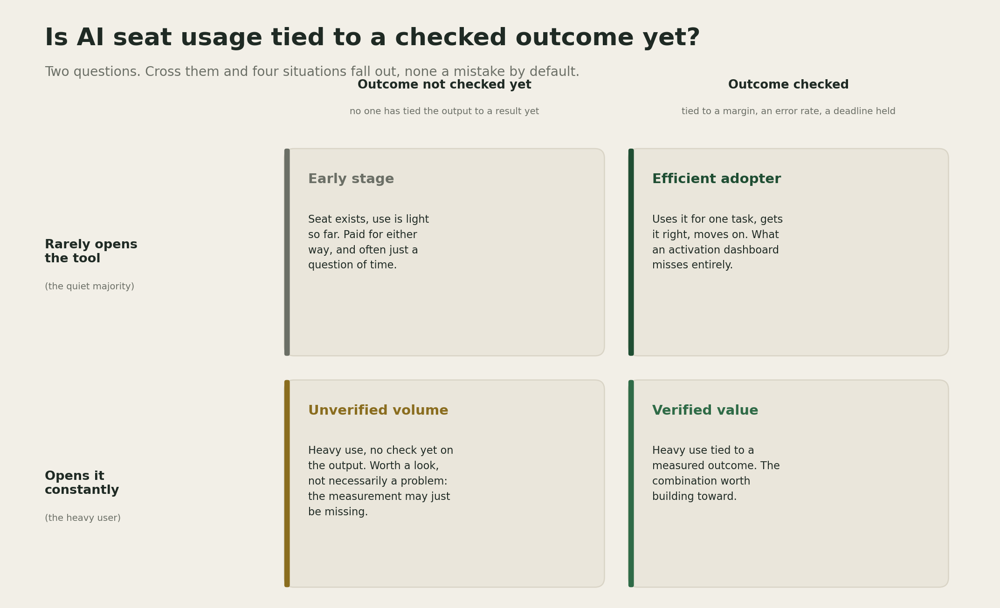

# AI Seats and the Utilization Problem

Two years ago, 32 people at the law firm Ropes & Gray sent a few hundred AI prompts a month.
Today, close to 2,200 people at the same firm send more than 282,000 prompts a month, and each
user is roughly three times as active as a year earlier
([Breitbart, citing Wall Street Journal reporting](https://www.breitbart.com/tech/2026/07/13/companies-turn-to-ai-champions-to-convince-fellow-employees-to-adopt-ai-tools/amp/)).
The growth did not come from a mandate. It came from a network of more than 60 internal
champions who kept showing colleagues what the tool was actually good for.

## The claim

That curve raises a question every firm now has to answer for itself: whether a rising login
or token count means the work got better, or just means more people are busy with the tool.
David Maister asked a version of the same question about billable hours thirty years ago. His
answer was that once utilization already covers its cost, more hours logged stop making a firm
more profitable on their own, and the only lever left is the value each hour produces.

## What the data actually shows

Microsoft's 2026 Work Trend Index splits AI users into three groups rather than a single
adoption number: about 19 percent are "Frontier" users with both strong personal skill and real
organizational support, 31 percent are held back by unclaimed capacity or organizational
blockers, and the remaining half sit in what the report calls an emergent zone, still finding
their footing
([Microsoft WorkLab](https://www.microsoft.com/en-us/worklab/work-trend-index/agents-human-agency-and-the-opportunity-for-every-organization)).
The same report finds that organizational factors, culture, manager support, and how work gets
structured, account for more than twice the measured impact of individual effort alone.

Ropes & Gray's trajectory fits that pattern rather than contradicting it. Adoption there took
two years and a champion network to move from a handful of curious early users to a firm wide
daily habit. Nothing in that timeline suggests most firms are behind schedule. It suggests
adoption compounds slowly and unevenly, mostly through people convincing other people rather
than through a rollout announcement.

## Why this is still worth watching

Cross how often a seat gets used against whether anyone has checked its output against an
outcome, and four situations fall out, none of them inherently a mistake.

Growth in usage and growth in measured value are two different curves, and most license
dashboards only show one of them. [YOUR DETAIL HERE] Economist Charles Goodhart's 1975
observation about monetary policy applies here too: once a number becomes the target, it tends
to stop measuring what it originally measured
([Goodhart's law](https://en.wikipedia.org/wiki/Goodhart%27s_law)). A firm that only watches
logins or token counts can end up optimizing for whichever behavior produces more logins or
tokens, which is not automatically the same behavior that produces better work. That is a
reason to add a second measurement, not a verdict on the firms that have not added it yet.

## The benefit case

A firm with a growth curve like Ropes & Gray's has something concrete to study: which tasks its
heaviest users gravitated toward, and what its internal champions were actually telling people.
That is close to free research into what the tool is good for inside that specific firm, well
ahead of a generic vendor claim.

## The open question

I hold this loosely. Most firms do not yet have a clean way to connect AI usage to project
margin, error rate, or client outcome, and that is a fair place to be two years into a
technology that is still changing quarter to quarter. Usage data is easy to produce because the
billing system already generates it. Outcome data takes deliberate measurement on top of that.
Microsoft's own finding, that organizational support matters more than individual effort,
suggests the firms that add that measurement will see it pay off before the firms that only
track logins do, not that the latter group did something wrong.

## The throughline

> A rising number of logins or tokens is a fact about activity, and a firm still has to check
> separately whether it is also a fact about better work.

## A prediction

> Prediction (2026-08-01): By the end of 2027, at least one major professional services or AEC
> firm will publicly report an AI usage metric tied to project margin or error rate, alongside
> its login or token numbers rather than instead of them. Confidence: medium.

## What I am watching next

Whether more firms publish a growth curve like Ropes & Gray's, and whether any of them also
publish what happened to a margin or error rate number over the same two years. Right now the
usage story is easy to find. The value story almost never gets published alongside it, which may
say more about measurement maturity than about effort.

---

<!--
Author note, delete before publishing:
- Add one specific detail only Lorela would know where [YOUR DETAIL HERE] sits above.
- Framework image generated at assets/activation-value-matrix.png via
  scripts/make_activation_value_matrix.py, same palette as the tokenomics, IP matrix, and speed
  premium assets. Labels softened from the first draft (shelfware, token theater) to neutral,
  descriptive ones (early stage, unverified volume) since the earlier framing read as judgmental.
- Maister's profitability formula and billable hour critique are drawn from a secondary summary
  of "Managing the Professional Service Firm" (https://tylerdevries.com/book-summaries/managing-the-professional-service-firm/),
  not the original text directly; flag this if it matters for the final review pass.
- Run the pre-publish checklist in docs/style-guide.md before shipping.
-->
