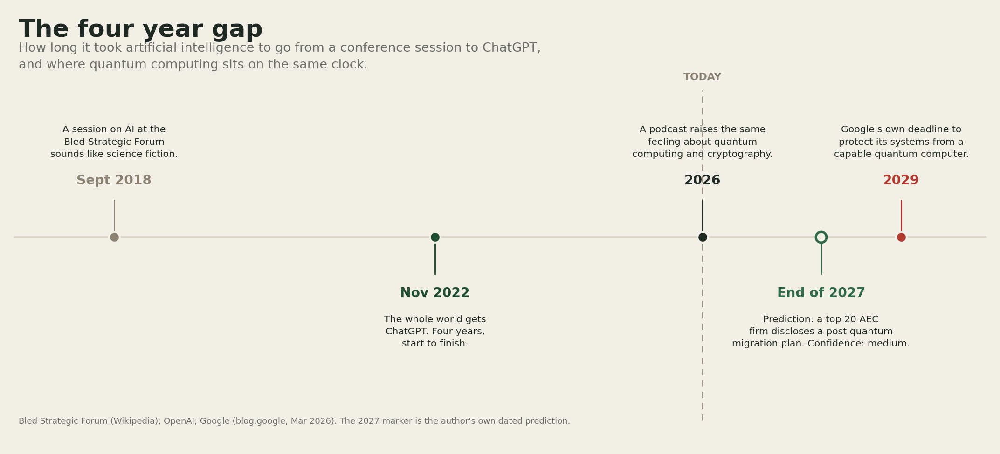

# The Four Year Gap

A story about getting a timeline wrong once, and trying not to do it again.

In September 2018 I sat in a session on artificial intelligence at the Bled Strategic Forum. It's an annual conference the Slovenian government started in 2006, held every September on the shore of Lake Bled, where government leaders, diplomats, academics, and journalists sit in the same rooms and talk about what's coming next, according to [Wikipedia, Bled Strategic Forum](https://en.wikipedia.org/wiki/Bled_Strategic_Forum).

The AI panel sounded like science fiction to me. I remember thinking, pretty clearly, that none of it would happen in my lifetime.

Four years later, on November 30, 2022, the whole world got ChatGPT from [OpenAI](https://openai.com/index/chatgpt/). I was wrong. Not a little wrong. Wrong in a way that has stayed with me since.

*So much for that instinct.*

I think about that a lot. Not because I feel foolish about the timeline. Everyone in that room got the timeline wrong. What stayed with me is what my own mind did. It heard something that sounded impossible and quietly filed it under not yet, not for me. Then it happened anyway, faster than almost anyone in that room seemed to expect.

I'm not telling you this to make myself look bad. A few months ago I got the exact same feeling again, and this time I actually noticed it happening.

I was listening to a podcast about quantum computing, specifically about the risk it poses to cryptography. Same feeling as Bled. Far away. Like it belonged to some other decade, not mine.

Except this time I didn't want to wait another four years to find out if my instinct was wrong again. I went and researched it. Here's what I found.

There's a name for the moment a quantum computer becomes powerful enough to break the encryption the internet runs on. People call it Q Day. Nobody knows exactly when it lands. But some of the people closest to the problem have started putting real dates on their own preparation, and that's what caught my attention.

[Google](https://blog.google/innovation-and-ai/technology/safety-security/cryptography-migration-timeline/) put an actual date on its own version of that problem. On March 25, 2026, it set an internal deadline: full post quantum protection across its own systems by 2029.

The reasoning has nothing to do with when a working machine actually shows up. Someone can record encrypted traffic today, save it, and decrypt it later once a capable enough machine exists. Google calls that harvest now, decrypt later. Whatever you send today, someone might already be filing it away.

Craig Gidney, a researcher at Google, published a paper on [arXiv](https://arxiv.org/abs/2505.15917) in May 2025. It showed that a quantum computer with fewer than a million noisy qubits could factor a 2048 bit RSA key in under a week. Back in 2019, his own estimate for that job was about 20 million qubits. That's roughly a twenty times drop in six years. That's the wrong direction if you're the one relying on that encryption.

[NIST](https://www.nist.gov/news-events/news/2024/08/nist-releases-first-3-finalized-post-quantum-encryption-standards) finalized its first three post quantum encryption standards on August 13, 2024. It didn't attach a firm cutoff date. What it said instead was simple. Start migrating now. Don't wait for one.

I work in this industry, and I don't want to hand you a scare piece.

Most AEC firms, the architecture, engineering, and construction industry, aren't defense contractors or banks. Nobody is telling a mid sized structural engineering firm to migrate its systems by a fixed date. Not yet. That's a real reason not to panic about this on a Monday morning. I still wouldn't wait for a client or an insurer to force the question.

The exposure starts the moment a capable quantum computer exists, whenever that turns out to be. That's what actually convinced me this matters, even for a firm like mine. Call that one clock. A separate, slower clock governs when quantum computers get good enough to actually be useful for engineering work. The risk clock starts ticking well before the usefulness clock does. I keep coming back to that. Not the exact year. The order things happen in.

*The cryptography risk is the one keeping me up. The building side of this is slower, and just as interesting.*

A 2024 review of quantum computing in civil engineering, published on [arXiv](https://arxiv.org/html/2402.14556v1), looked at where the real potential sits. Three places, mainly: optimization problems like construction scheduling and structural sizing, machine learning for structural health monitoring, and simulation for finite element analysis.

Then the same review said the honest part out loud. Today's quantum hardware is still what people call NISQ. Noisy. No error correction yet. A problem at the scale of an actual bridge or building could need millions of qubits and a fault tolerant machine that doesn't exist yet.

There is something real to point to, and it didn't stay in a lab. [Volkswagen Group](https://www.volkswagen-group.com/en/press-releases/volkswagen-optimizes-traffic-flow-with-quantum-computers-16995) ran the pilot that convinced me of that. During Web Summit in Lisbon in November 2019, nine public buses run by the transit operator Carris used a routing system built on a D-Wave quantum computer to calculate near real time paths through city traffic. Volkswagen had already tried something similar on taxis in Beijing back in 2016. Real buses, real streets. Small in scope. Still real.

Closer to my own field, three researchers, Zisheng Ye, Xiaoping Qian, and Wenxiao Pan, took on a classic structural optimization problem: finding the layout of material in a structure that minimizes how much it flexes under load. They split it in two, solved the larger part on a normal computer, and the smaller part on a D-Wave quantum annealer. According to [arXiv, Ye, Qian, and Pan](https://arxiv.org/abs/2301.11531), the hybrid method matched or beat standard classical methods on the test problems they ran. I want to be careful here. That's a narrow, self reported result on small test cases. It's not proof that quantum computing beats good structural software on a real building. Still, someone actually ran the test and got a real number back.

There's a materials angle too, and it's the one that made me sit up. [Quantinuum](https://www.quantinuum.com/blog/on-the-arxiv-modeling-carbon-capture-with-quantum-computing)'s researchers have used quantum simulation to model how metal organic frameworks, a class of material being actively researched for carbon capture, bind carbon dioxide molecules. Cement alone accounts for around 8 percent of global CO2 emissions, and a large share of that comes from the chemistry itself, the calcination process, according to [Chatham House](https://www.chathamhouse.org/2018/06/making-concrete-change-innovation-low-carbon-cement-and-concrete). If quantum simulation ever helps someone design a material that pulls that carbon out more cheaply, that's a story about what we build things out of, not about cybersecurity.

Where does that leave me. Honestly, in two different places at once.

I'm fairly confident about the cryptography risk. The math keeps moving one direction. Gidney's number keeps dropping. A company as careful as Google doesn't put a public date on something it isn't taking seriously. I don't know exactly when Q Day arrives. Nobody does. I don't think that's actually the question that matters most. What matters is whether your data is being copied today for someone to open later, once the machine exists to do it.

I honestly don't know yet whether the engineering case holds up. The hardware just isn't there. The buses in Lisbon and the beam problem Ye, Qian, and Pan solved are real, but they're small. Small signals take years to grow into something a project team would actually use.

Here's the one prediction I'll put my name on, dated, so you can check it yourself later. By December 31, 2027, at least one of the big global engineering and construction firms, companies like Arup, AECOM, Jacobs, WSP, Stantec, Mott MacDonald, or Ramboll, will have publicly disclosed a post quantum cryptography migration plan or timeline for its own systems, separate from some general AI or cybersecurity statement. My confidence in that is medium. I'd be surprised if none of them says anything by then.

*What I'm watching now.*

Two clocks, moving at very different speeds.

The fast one: whether any AEC firm follows Google's lead and puts an actual date on post quantum migration, instead of folding it into a vague paragraph about cybersecurity. That's the tell I'm looking for.

Then there's the slower signal. I want to see whether quantum structural optimization work, like Ye, Qian, and Pan's, starts showing up on problems closer to the size of a real project instead of small test cases. If it does, the slow timeline is starting to compress too, the way the fast one did after Bled.

I was wrong once about how much time I had to pay attention. I'd rather not be wrong twice.

---

<!--
Author note, delete before publishing:
- This is a full rewrite of the first draft, after your feedback that it read as orthodox and
  AI sounding. Process: three ghostwriter agents each wrote an independent story-style attempt
  from the same fact brief, an independent panel of three judges scored all three for
  humanness, simplicity, and whether they stuck to the facts (their harshest, recurring note on
  every early draft: every source citation used an identical trailing parenthetical formula,
  and several sentences fell into matched, symmetric clause pairs, both classic AI tells), a
  synthesis pass combined the strongest draft with the best specific lines from the other two,
  and two independent editors then hunted the merged draft for anything that still sounded
  machine written. This is the result of that last pass.
- No "##" section headers this time, at your direction. It reads as one continuous story. The
  substance the house style needs is still in there: every fact sourced with a working link,
  a benefit case and a risk case, a calibrated confidence line for each ("I'm fairly confident
  about the cryptography risk," "I honestly don't know yet whether the engineering case holds
  up"), a dated and checkable prediction, and a forward looking close. There is no boxed
  "throughline" blockquote; the closing line ("I was wrong once... I'd rather not be wrong
  twice.") is doing that job narratively instead.
- Added the timeline graphic you asked for: assets/four-year-gap-timeline.png, built with
  scripts/make_four_year_gap_timeline.py to match this repo's existing chart style (same
  palette and fonts as the other issues' charts). Placed it at the "two clocks" turn near the
  end, where it recaps the whole story at a glance right before the closing line.
- I caught and fixed one internal slip that survived the rewrite pipeline: an earlier line said
  "wait five years" to find out about quantum computing, which contradicted the "four years"
  established at the top of the piece (Bled 2018 to ChatGPT's November 2022 launch). Fixed to
  "another four years."
- Sent that assembled draft to two more independent cold readers, specifically to stress test
  whether it actually reads human now rather than just checking mechanical rules. Both agreed it
  was a real improvement but both, independently, caught the same residual tell: a "here's why /
  let me be honest here / here's the part that convinced me" habit of narrating its own
  transitions (down from seven instances to two, kept only where the flag genuinely earns its
  place), a mirrored "The near one... / The far one..." sentence pair at the close (rewritten so
  the two paragraphs no longer share a skeleton), one line that echoed the banned "not about X,
  it is Y" shape (rewritten as a direct claim), and two claims that were asserted without a
  source: "target national security systems and federal agencies" (cut, since I could not
  independently verify it) and "top 20 global AEC firms by revenue" (softened to "big global
  engineering and construction firms," since the named companies are illustrative examples for
  a dated prediction, not a claim to a specific ranking). One flagged citation, the 2016 Beijing
  taxi detail sharing a link with the 2019 Lisbon pilot, I had already verified directly earlier
  in this session: the same Volkswagen press release states both facts, so no change was needed
  there, just something neither cold reader could confirm without web access.
- The pillar tag ("risk") and the note that this issue sits further from the newsletter's usual
  AI and pricing thesis than most issues still stands from the previous draft; that editorial
  call has not changed, only the writing has.
- prediction_logged is correctly "no" until you publish and copy it into
  templates/predictions-ledger.md, same as every other issue.
- Read it aloud once before it goes out. That is still the one check nothing else here can do
  for you.
-->
