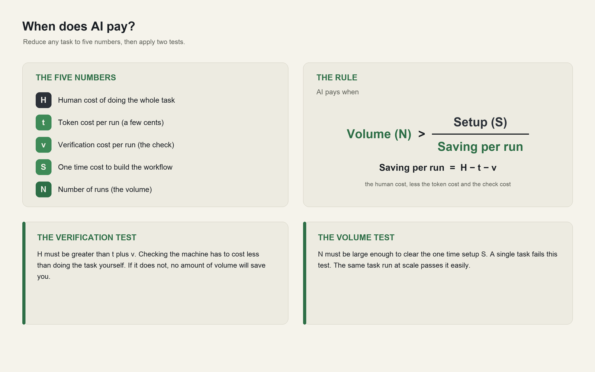
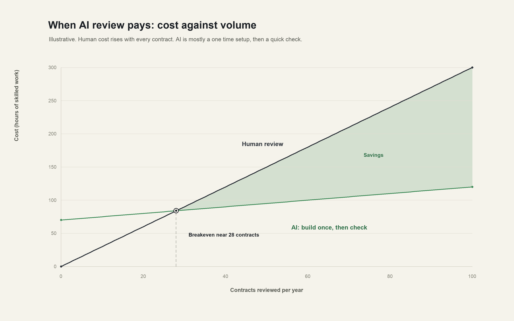

# AI Tokenomics: When AI Pays, and When It Does Not

The token is now the cheapest thing in the stack. So the real question is tokens versus benefit,
and the honest answer is that the benefit shows up at volume, on tasks you run again and again,
and rarely on a single bespoke one.

## The claim

The price of a token has fallen so far that it has almost stopped mattering. What decides whether
AI pays is everything around the token: the cost of building the workflow once, and the cost of
checking the output every time. Those costs are close to fixed per use case, so they only pay
back when you spread them across many runs. Read that sentence again, because it is the whole
argument. AI tokenomics turns on volume and verification, and the token price is a rounding
error inside it.

## The token is cheap, and getting cheaper

Start with the raw input. Stanford's AI Index found that the cost of running a system at the
level of GPT-3.5 fell more than 280 times between late 2022 and late 2024, from about 20 dollars
per million tokens to about 7 cents in roughly 18 months
([Stanford HAI, AI Index 2025](https://hai.stanford.edu/ai-index/2025-ai-index-report)). On
current published rates a fast model sits near 1 dollar per million input tokens, a mid tier model
near 3 dollars, and a frontier model near 5 dollars, with output a few times higher. Caching the
context you reuse removes about 90 percent of the cost of that repeated part, and running work in
batches removes another 50 percent
([Anthropic pricing](https://platform.claude.com/docs/en/about-claude/pricing)).

Put that in human terms. A first pass over a contract of a few thousand words costs a few cents of
tokens. A page of analysis costs a fraction of a cent. At these prices the token bill for a single
task is almost never the reason to say yes or no. That is the first thing to internalise, because
most conversations about AI cost are aimed at the one number that barely moves.

## The cost that actually decides it

The token is cheap. Two things around it are not.

The first is setup. Building a workflow that produces reliable output on your kind of task, wiring
it into how work already flows, and testing it on real cases is a real investment, and it happens
once per use case. MIT's study of enterprise AI found that about 95 percent of pilots deliver no
measurable return, and the cause was rarely the model. It was the absence of workflow integration
and a defined outcome before the build began
([Fortune, on the MIT report](https://fortune.com/2025/08/18/mit-report-95-percent-generative-ai-pilots-at-companies-failing-cfo/)).
Buying a specialised tool succeeded about two thirds of the time, while internal builds succeeded
about a third as often, which tells you setup is the hard part, and that most of the value is in
getting it right once.

The second is verification. When a machine drafts the answer, someone still has to check it and
stand behind it. That review time is now where much of the true cost sits, and it recurs on every
single run. The size of the machine's own work varies more than people expect, which feeds
straight into verification. Studies of agentic systems show them consuming five to thirty times
the tokens of a simple chat, with a light agent using five to fifteen thousand tokens per task and
a complex multi step agent using hundreds of thousands to over a million, and the same task
varying by up to ten times from one run to the next
([Tokenomics, agentic software engineering](https://arxiv.org/abs/2601.14470),
[Stanford Digital Economy Lab](https://digitaleconomy.stanford.edu/publication/how-do-ai-agents-spend-your-money-analyzing-and-predicting-token-consumption-in-agentic-coding-tasks/)).
The token cost of all that is still small. The point is that variable, multi step output is harder
to check, and checking is the expensive part.

## The framework: tokens versus benefit

Here is a way to decide, honestly, whether a task is worth automating. Reduce it to five numbers,
then apply two tests.

Both tests must pass.

**The verification test.** H has to be larger than t plus v. If checking the machine costs about
as much as doing the task yourself, automation saves nothing at any volume. This is why structured,
rule governed tasks with a clear right answer are the sweet spot, and why open ended judgement
where every output needs a full human re read is a poor fit today.

**The volume test.** Even when each run is cheaper, you have to run it enough times to clear the
setup cost S. A high value one off task fails this test on its own, because there is nothing to
spread S across. The same task at scale passes easily.

## A worked example

Take a first pass review of routine contracts. The token cost of one contract is a few cents. A
full manual review takes about three hours of skilled time, while a machine draft plus a focused
human check of the flagged clauses takes about thirty minutes, so each run saves roughly two and a
half hours. Building and testing a dependable pipeline is a one time cost of sixty to eighty hours.
Spread that setup across the hours saved per contract and the two lines cross at around thirty
contracts a year.

The real world numbers match the shape. A December 2025 study of more than a hundred enterprise
legal teams reported about fourteen hours saved per lawyer each week and roughly 252,000 dollars a
year in savings for the median customer, with forty to sixty percent time savings on routine
review ([GC AI](https://gc.ai/blog/ai-contract-review)). A 2026 Wolters Kluwer survey found 62
percent of professionals saw time savings of six to twenty percent a week
([Wolters Kluwer](https://www.wolterskluwer.com/en/expert-insights/legal-ai-adoption-time-savings-revenue-growth)).
Those returns come from firms running the same task hundreds or thousands of times. A firm that
reviews ten contracts a year would see none of it.

## Where it makes sense, and where it does not

The framework draws a clean line.

**It makes sense** on work that is high in volume, repeated in a stable form, governed by clear
rules, measurable, and cheap to verify. Document review and extraction, invoice and expense
processing, first pass proposal drafting, due diligence checklists, coding of structured data,
compliance screening, customer and support triage. This is why MIT found the largest returns in
back office automation, even though more than half of AI budgets were being spent on sales and
marketing ([Fortune](https://fortune.com/2025/08/18/mit-report-95-percent-generative-ai-pilots-at-companies-failing-cfo/)).
Enterprise analyses put the gains on these high volume processes at twenty to forty percent lower
cost and up to seventy percent fewer errors
([Thinslices](https://www.thinslices.com/insights/why-ai-automation-roi-is-highest-on-repetitive-high-volume-processes)).

**It rarely makes sense** on a single bespoke deliverable, on low volume work where setup can never
amortise, on high stakes output that a human must fully redo to trust, or on any task where
verification costs as much as doing it. For those, a person remains the better economic choice, and
saying so out loud is part of using AI well.

## Where to be careful

A few habits keep the volume play working.

Design for the fixed costs, since they are where the money is. Define the outcome before you build,
buy a specialised tool where one exists rather than building from scratch, and treat the evaluation
harness as part of the product. This is the difference the 95 percent missed.

Budget verification as a real line, not an afterthought. The cheaper the drafting becomes, the more
the value concentrates in the check. Sample and score output, route only the uncertain cases to a
human, and measure the error rate you are willing to accept.

Cap and monitor token spend at the task level, because agent consumption is variable by up to ten
times and can climb quietly as you add steps
([Tokenomics](https://arxiv.org/abs/2601.14470)). The unit is cheap, the total is not automatic.

Pick a small number of high volume use cases and prove the return before scaling. Only about six
percent of firms are capturing more than five percent of profit from AI, and most of the rest are
stuck in pilots that never chose a volume worth the setup
([Fortune](https://fortune.com/2025/08/18/mit-report-95-percent-generative-ai-pilots-at-companies-failing-cfo/)).

## The throughline

The token stopped being the constraint a while ago. The benefit comes from putting cheap tokens on
work you do a thousand times, where the output is easy to check and the setup cost has somewhere to
spread. Choose the high volume, verifiable tasks, invest once in doing them properly, and the
falling price of machine work turns into a real and durable gain. Point the same tools at a single
bespoke problem and the numbers will not carry you.
